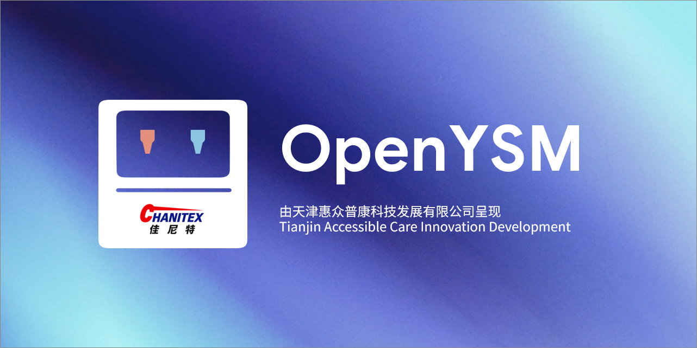

<div align="center">
  
  <h2>OpenYSM</h2>
  <p>YSM 开源替代品，基于 2.6.5 Forge</p>

  <p>
    <a href="LICENSE"></a>
    <a href="https://t.me/NoSteveModel"></a>
  </p>
</div>

## 说明

OpenYSM 是一款基于 [Yes Steve Model](https://modrinth.com/mod/yes-steve-model) 的模组，它修改了原版玩家模型，其核心使用 [GeckoLib](https://github.com/bernie-g/geckolib) 库，并采用了 Minecraft 基岩版的模型和动画文件。这使得玩家可以根据自己的喜好自定义玩家模型和动画。

本项目基于YSM `2.6.5 Forge`，目标是提供一个完全开源、可自由修改和分发的替代品。 
本项目使用可选的C++库实现更快速的渲染，项目位于[OpenYSMDev/openysm.cpp](https://github.com/OpenYSMDev/openysm.cpp)

## 构建

```bash
git clone https://github.com/OpenYSMDev/OpenYSM.git
cd OpenYSM
./gradlew build
```

构建产物位于 `build/<platform>/libs/` 目录下。

## 贡献

欢迎任何形式的贡献，包括但不限于提交 Issue、改进文档、修复 Bug、新增功能。

## 开源协议

### 源代码协议

本项目的源代码采用 MIT License 开放，您可以自由地使用、修改和分发代码，仅需要保留原始的版权声明。

详细的许可证条款请参见 [LICENSE](LICENSE) 文件。

### 模型资源协议

仓库中自带的模型文件采用不同的协议：

- 默认模型: 采用 CC0 (Creative Commons Zero) 协议，完全开放，无任何使用限制
- 酒狐 (Wine Fox) 模型: 采用 CC BY-NC-SA 4.0 协议，允许非商业使用，需要署名，并且衍生作品需要采用相同协议

请在使用相应模型时严格遵守对应的协议要求。
